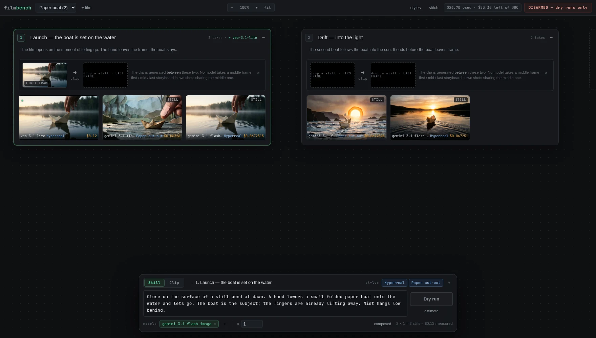
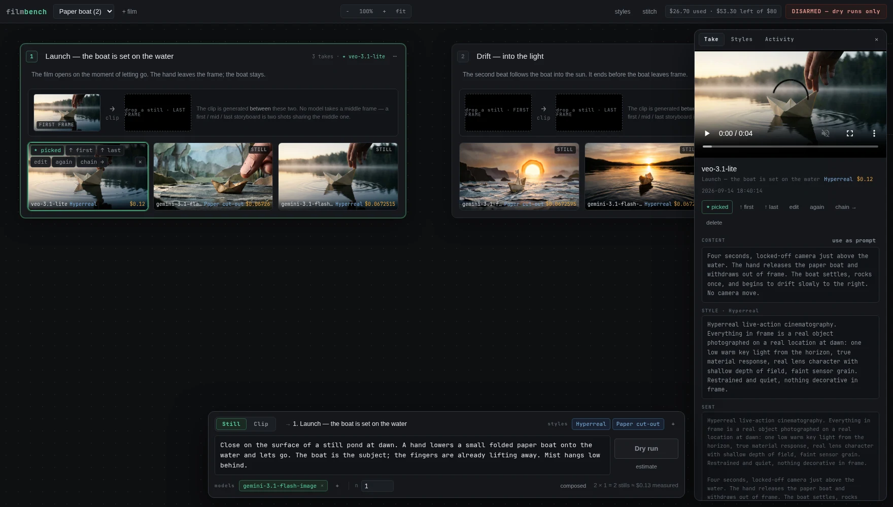
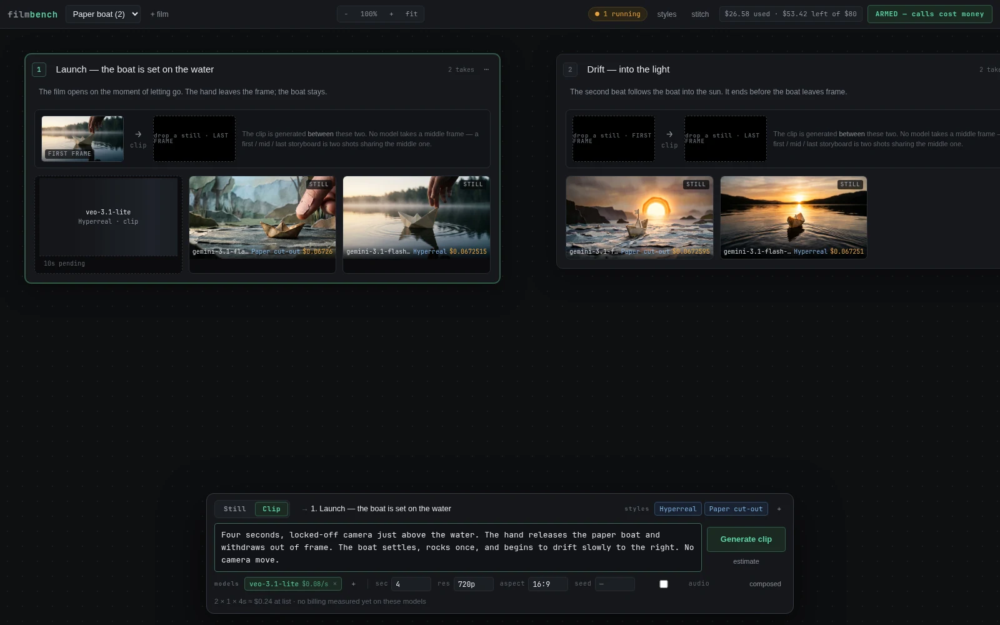
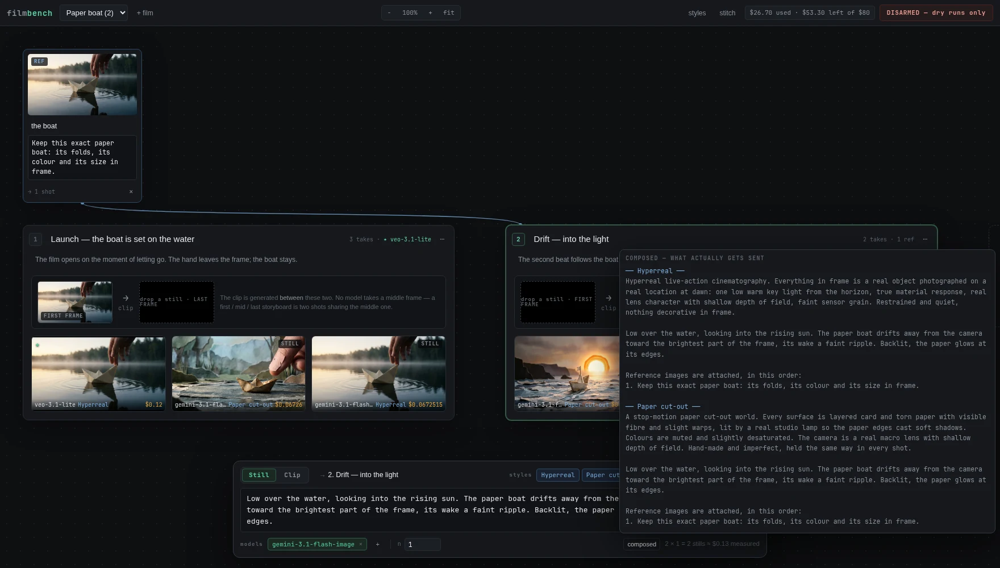
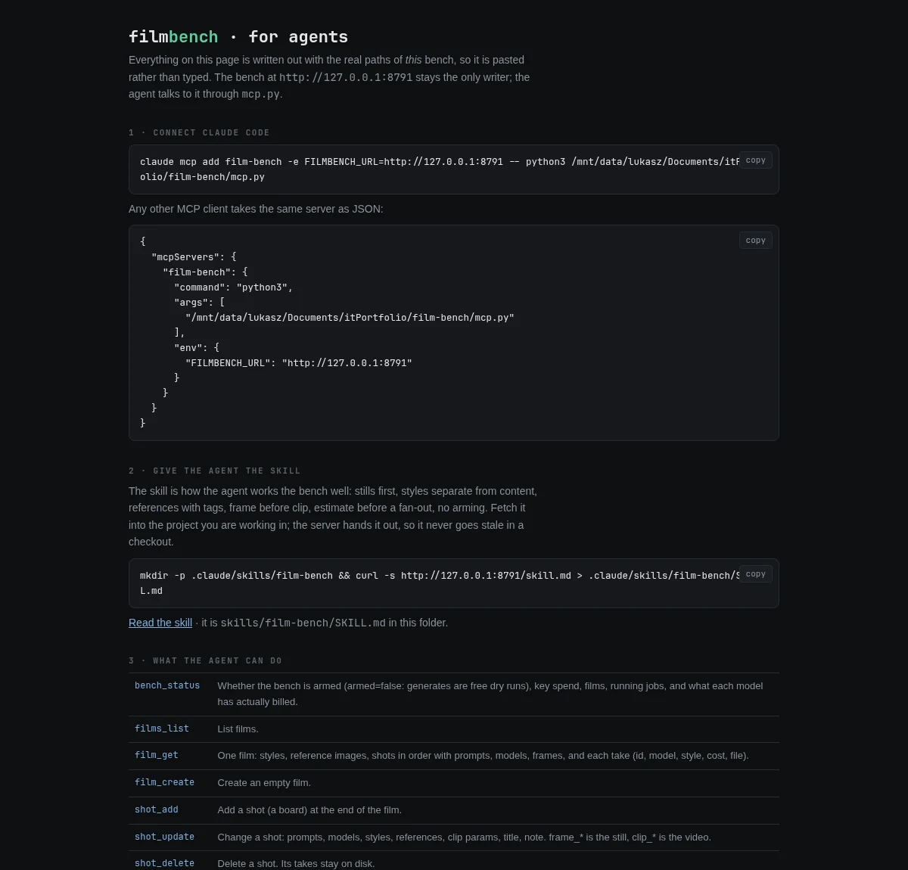
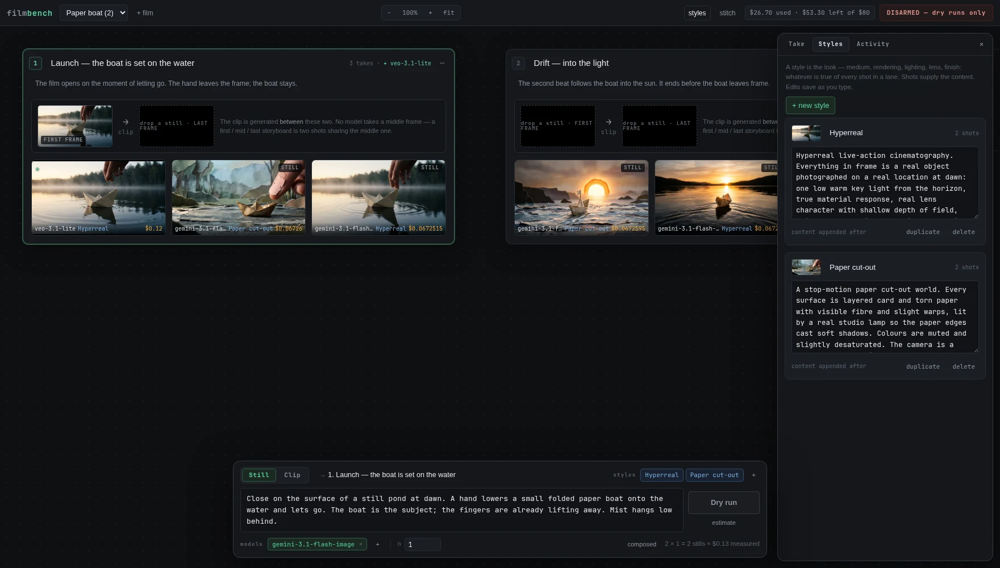
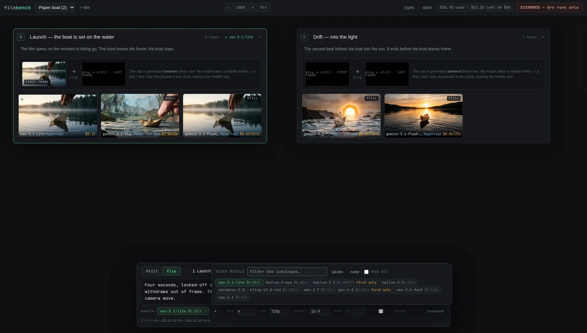
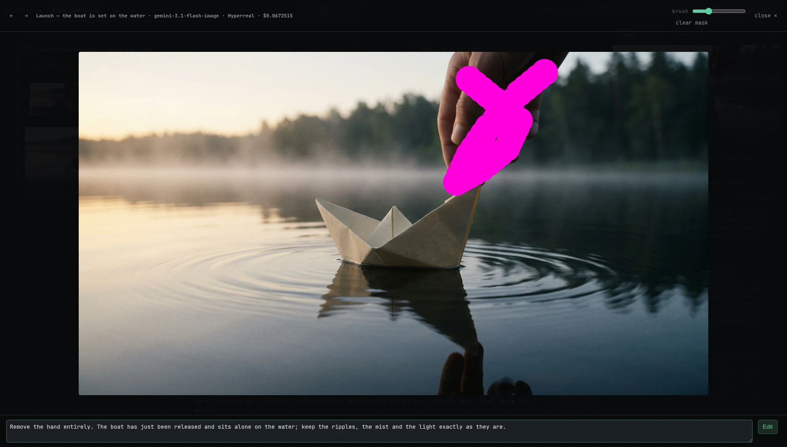
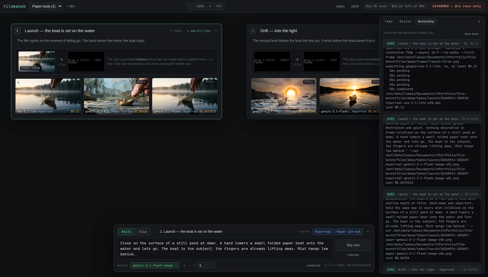

# film-bench

A canvas for making short AI films one shot at a time. Boards are shots, cards are takes, and one prompt bar at the bottom generates stills and clips through OpenRouter, across several models and styles in one press.



```
git clone https://github.com/l-kedzielawski/film-bench && cd film-bench
cp .env.example .env && chmod 600 .env     # put your OpenRouter key in it
python3 bench.py                            # http://127.0.0.1:8781
```

It needs Python 3 and ffmpeg on the PATH, and nothing else: no pip install, no node, no build step.

## Why

Generating video from a shell is not an iteration loop. You run a command, open the file in a player, edit the prompt in a text file, run again, and after an hour you no longer know which prompt made which clip or what the afternoon cost. A form-based UI is only a little better: the picture you are judging sits in one panel and the controls that made it sit in another.

Tools like Recraft get this right: the pictures are the workspace, one bar makes things, and details appear only when you select something. film-bench applies that shape to short films, where the unit of work is a shot and the hard problem is keeping a character or an object the same from one clip to the next.

## How it works

**Boards are shots, left to right in film order.** Drag a board by its head along the row to reorder it. The order is saved, because the order of the boards is the cut. The dashed board at the end adds a shot, `✕` on a head deletes one, and `⋯` carries centre, duplicate, move earlier or later, and free placement.

**Arrange the nodes however you like.** Pull a board *downwards* off the row and the film switches to free placement: from then on a drag just moves the node wherever you want it, and positions are saved per node so the arrangement survives a reload. Hold `ctrl` (or `⌘`) and any node can be picked up from anywhere on it — over its title, its notes, its cards — rather than only by its head; reference nodes also carry a `⠿` grip in their footer. Film order never depends on where a node sits — it stays the number badge on the head, changed with `alt` + `←` `→`. *Tidy every node back into a row* in either `⋯` menu throws the positions away.

**Cards are takes, newest first.** Hover a clip and it plays. Click a card and a toolbar appears on it: pick it for the cut, use it as a first or last frame, edit it, run the same model and style again, chain it into the next shot, delete it. Double-click to enlarge.

**Frame slots sit at the top of each board.** Drag any still onto FIRST or LAST, from any board, and the next clip is generated between those exact pixels. This is the mechanism that keeps a subject consistent across shots: image-to-video takes a frame as pixels and does not care what produced it.



**The prompt bar writes to the board you last clicked.** Still or Clip, the prompt, which styles to render in, which models to run, the parameters, and what it will cost. Press Generate and a shimmering placeholder appears on the board with the generator's live log printed on it. When the job ends, the real card takes its place. An error stays as a red card until you dismiss it.

**The bar folds, in four steps**, with `⌃ ⌄` in its top-right corner or `B` and `shift`+`B`. *Full* is everything; *compact* drops the styles, refs and model rows; *folded* is a single strip — what it will do and the button that does it; *hidden* takes it off the screen entirely, leaving one small `⌃` in the bottom-right corner to bring it back. The folded rows stay in force, so *compact* and *folded* carry a summary of the models, styles, references, `n` and the cost. Folding hides controls, never a charge — which is why *hidden* takes Generate away with it rather than leaving a button that spends against settings you cannot see.



## Reference images

Drop image files on the canvas, paste one from the clipboard, press `+` next to **refs** in the bar, or press `→ ref` on any take. Each becomes a node in a row above the boards, with a thumbnail, a name and a tag: the sentence that tells the model what to take from it. "Take the texture of the hull from this image." "Match this lighting." Drag a node onto a board to link it, or toggle it in the bar. A wire runs from every node to every board that sends it, so the graph reads at a glance.

Linked references go with every still the board generates, in the order they are linked, and the composed prompt gets a numbered block that ties each image to its tag:

```
Reference images are attached, in this order:
1. Keep this exact paper boat: its folds, its colour and its size in frame.
```

The dry-run command shows one `--ref` per image, and the take's sidecar records which references it was made from. Clips do not take reference images on this API, so a reference shapes the still, and the still becomes the clip's first frame.



**Double-click a reference** to open it large. Its name and what to take from it are editable there with room to write, and **Replace image…** swaps the picture under the node. The id survives, which is the point: every board that sends the reference links to that id, so deleting and re-adding would unlink it everywhere and lose the tag. A replaced picture appears everywhere at once — the card, the bar chip and the lightbox — because a reference is the one file whose path stays the same while its bytes change, so its URL carries a version derived from the file's own mtime. Replacing keeps both, and every linked board picks the new picture up.

## Driving it from an agent

`mcp.py` is an MCP server over stdio. It forwards every call to the running bench's HTTP API, so the bench stays the only writer and disk stays the source of truth. Register it once:

```
claude mcp add film-bench -- python3 /path/to/film-bench/mcp.py
```

Or open **agent** in the top bar. That page writes the setup out with this bench's real paths filled in, so it is pasted rather than typed: the `claude mcp add` line, the same server as JSON for any other MCP client, and a curl that fetches the skill into the project you are working in. The bench hands the skill out at `/skill.md`, so no checkout carries a stale copy.



The skill (`skills/film-bench/SKILL.md`) is how an agent works the bench well: check the state first, read the film before touching it, stills before clips, styles separate from content, references with tags, a frame set before any clip, an estimate before a fan-out, and a report at the end that names takes and costs.

The server exposes 18 tools: `bench_status`, `films_list`, `film_get`, `film_create`, `shot_add`, `shot_update`, `shot_delete`, `shots_reorder`, `style_set`, `ref_set`, `generate`, `job_get`, `take_pick`, `frame_set`, `edit`, `stitch`, `models` and `price`. An agent can lay out a film, write the styles, attach references, run stills, promote a frame, generate the clip, edit a take and stitch the cut.

The arm switch is not a tool. While the bench is disarmed, every `generate` an agent asks for is a dry run: the exact request and its price, with nothing charged. A person arms the bench in the browser when money should move, and `generate` returns `dry_run: true` until then, so the agent knows where it stands.

## Style and content are separate

A shot's prompt says what happens. A style says what it looks like: medium, rendering, lighting, lens, finish. Styles belong to the film and shots subscribe to them. The bench folds the two together at call time and shows the result under `composed`, so the preview is the request that gets sent and not an approximation of it.

This is what makes a comparison honest. The demo film renders the same two beats in two styles, Hyperreal and Paper cut-out, from one content prompt each. Two styles and three models is six calls, and the bar says so before you press anything.



## Stills first, clips second

A still costs cents and a clip costs dollars, so every look decision is made on stills. The bar starts on Still for that reason. Generate candidates across several image models, drag the right one onto FIRST, switch to Clip, and the video call is grounded in it.

A shot holds a list of models, not one. Tick several and the same prompt runs on all of them; each result is a card with its model, style and cost, side by side on the board.



## First, middle, last

No video model takes a middle frame. They take a first frame, and most take a last one, and generate the clip between them. So a first / middle / last storyboard is two shots that share the middle still: it is the LAST frame of shot A and the FIRST frame of shot B. Both clips literally begin and end on those pixels, which is why the cut between them is invisible.

Models that accept a first frame only are marked in the picker, and the bar warns before you spend on a call the generator will refuse.

`chain` on a clip does the same thing after the fact: it extracts the clip's real last frame into the next board as its first frame, recovering continuity from whatever the model produced.

## Editing a still

Enlarge a card, paint over the part to change, and say what should happen there: change this and this, leave the rest. The painted region limits the edit; the rest of the image comes back untouched.

This is not inpainting, because no image model on this API takes a mask. The model receives the clean original and a copy with the painted area burned in as magenta, plus an instruction saying the magenta marks the part to change and must not appear in the result. With nothing painted, the instruction applies to the whole image.



## Money

**The bench starts disarmed.** While it is, the Generate button says Dry run: the exact request body and a cost estimate go to the log, and nothing is charged. Arming asks once. An armed fan-out of more than one call asks again and lists the models.

Every estimate says where its number comes from, because stills and clips are priced in different ways.

- Clips have a list price. The bar shows the floor `bin/gen price` computes for that exact call: duration times the SKU that matches the resolution and audio setting. A 4 second clip on veo-3.1-lite at 720p without audio is $0.12.
- Stills have no list price anywhere on this API. They are estimated from what the same model billed before, the median of its real calls in the provenance log, and labelled *measured* wherever the number appears. A model with no history says so instead of inventing a figure.
- Expected billing uses each video model's measured ratio of real charge to floor. Where a model has always billed its floor, the bar says *bills at list here*.

The numbers show up before you press anything (the cost line under the prompt), on each job in Activity, in the log itself, and as one toast per fan-out when every job in it has finished.

**The bar offers only the parameters the picked model accepts.** The catalogue publishes real per-model limits — images per call, allowed resolutions and aspect ratios, how many references — and the still params read them: `n` is capped and greyed out at a model that makes one image per call, `res` and `aspect` are populated from that model's own list, and a parameter only some of the picked models understand is not offered at all, since the same request goes to every one of them. It is a clamp, not a label: a value already stored outside the limits is pulled back inside when you open the film or land on the shot, with a line saying what changed. Asking a model capped at one image for two is an HTTP 400 you would otherwise discover by paying for it.



## On disk

Disk is the source of truth and the server is its only writer. Every take has a sidecar next to it, so any card on screen can answer what made it, from what prompt, for how much. Every real call also appends a line to `genlog.jsonl`, which is the record the EU AI Act asks for and the data the cost estimates are built from.

```
films/<slug>/film.json                  the film: shots, styles, references, prompts, models, params
films/<slug>/refs/<id>.png              reference images
films/<slug>/frames/<shot>-first.png    first and last frames
films/<slug>/takes/<shot>/<take>.mp4    the take
films/<slug>/takes/<shot>/<take>.json   its sidecar: model, full prompt, params, cost
genlog.jsonl                            one line per real call, with what it cost
```

The canvas adds almost nothing to the data. Board order is shot order, and where you have panned to and how far you have zoomed are kept in the browser. The one exception is free placement: an `x`/`y` on a shot or a reference, written only once you move a node off the default row, and removed again by *tidy*.

Deleting a film asks you to type its name and then moves the whole directory to `films/_trash/<slug>-<timestamp>` rather than removing it. A film is every take ever generated for it, which is real money, so it stays recoverable by moving the directory back.

## The key never leaves `bin/gen`

The repo has three moving parts: `bench.py` (the server and the canvas), `bin/gen` (the only thing that talks to OpenRouter) and `mcp.py` (the agent door), plus the skill under `skills/`. None of them needs anything installed beyond Python 3 and ffmpeg.

`bin/gen` is a small CLI over OpenRouter's image and video endpoints, and it is the only process that opens `.env`. The bench spawns it, streams its output to the browser, and parses the cost. Nothing in the server or its logs can leak the key, and `gen` refuses a key file that other users can read.

```
gen models image|video [PATTERN]        the live catalogue with prices and frame support
gen models image --json                 the same records raw, per-model limits included
gen price MODEL --duration 6 --resolution 720p
gen image --model M --prompt P --out FILE [--resolution R] [--aspect A] [--ref IMG]... [--dry-run]
gen video --model M --prompt P --out FILE --first-frame F [--last-frame F] [--dry-run]
gen spend                               key usage and what is left
```

## Keyboard

| Key | Does |
|---|---|
| Ctrl + Enter | Generate, or dry run, for the active board |
| 1 / 2 | Still / Clip |
| F, or double-click the background | fit the whole film |
| Space + drag | pan, even over a board |
| Ctrl + drag | move a node from anywhere on it |
| Ctrl + wheel | zoom around the cursor |
| Esc | close dialog, lightbox, popover, selection, panel, in that order |
| Left / Right | previous or next shot — or previous or next take, in the lightbox |
| Alt + Left / Right | move the active shot earlier or later in the film |
| Delete | delete the selected take — or the active shot, when no take is selected |
| N | new shot · Shift + N new film · D duplicate the active shot |
| B / Shift + B | fold the prompt bar a step down or a step up |
| S / L | styles panel · activity log |
| / | jump into the prompt |
| ? | show this list in the app |

## Checking that the buttons work

`web/_selftest.html` loads the canvas in an iframe and clicks through every control: boards, the bar, Still / Clip, the model picker, style chips, autosave, arming, card selection, drag onto a slot, the lightbox and its mask, the Styles panel, adding and deleting a shot, board reorder, a reference wired to a board, zoom, stitch, the still params against each model's published limits, the clamp that pulls a stored value back inside them, free placement, ctrl-dragging a node from its middle, and tidy, the reference lightbox and its name and tag round-trip, both ways of deleting a shot, the prompt bar folding through its four steps, and the shortcut sheet. It snapshots the whole film first and puts every shot and style back at the end. Its last line is either `no repairs needed` or a list of what it had to repair, and a repair means a step above did something it should not have.

It exists because every control that used `window.prompt` once went dead when Chrome's "prevent this page from creating additional dialogs" was ticked. The page rendered, nothing threw, and no button worked. All dialogs here are in-page, and a script error shows a red banner instead of leaving dead buttons behind.

## Demo film

`films/demo` is a two-shot film about a paper boat, rendered in both styles. The four stills and one clip in it cost $0.39 in total on the models named in their sidecars.

## Licence

MIT.
